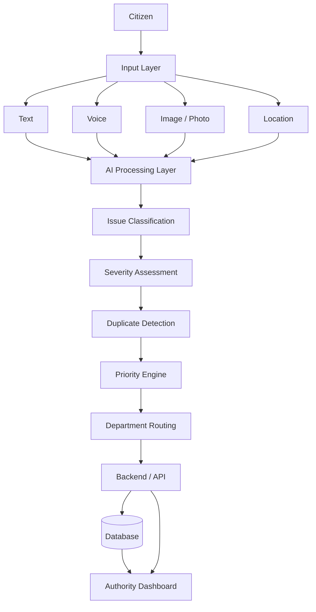
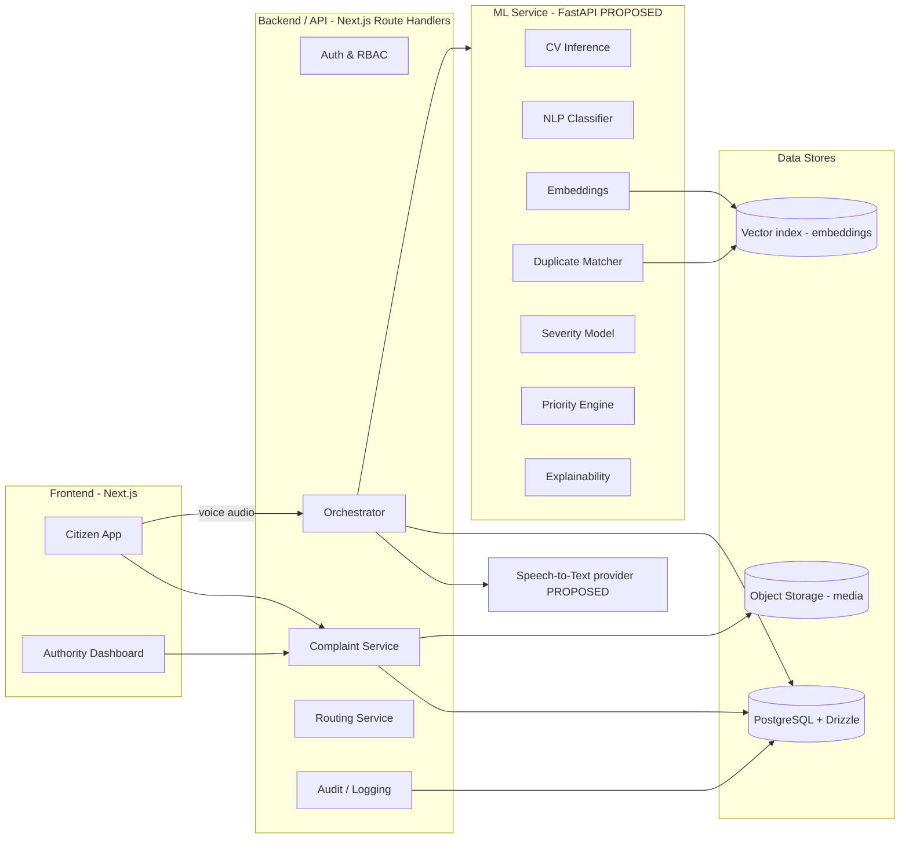
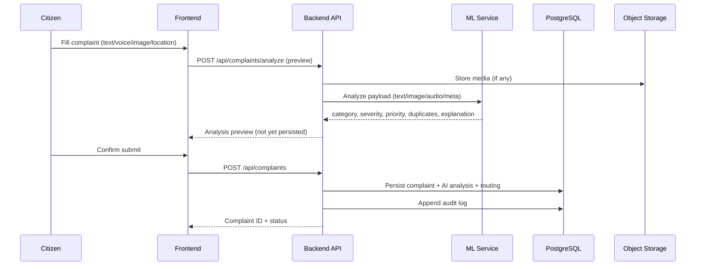
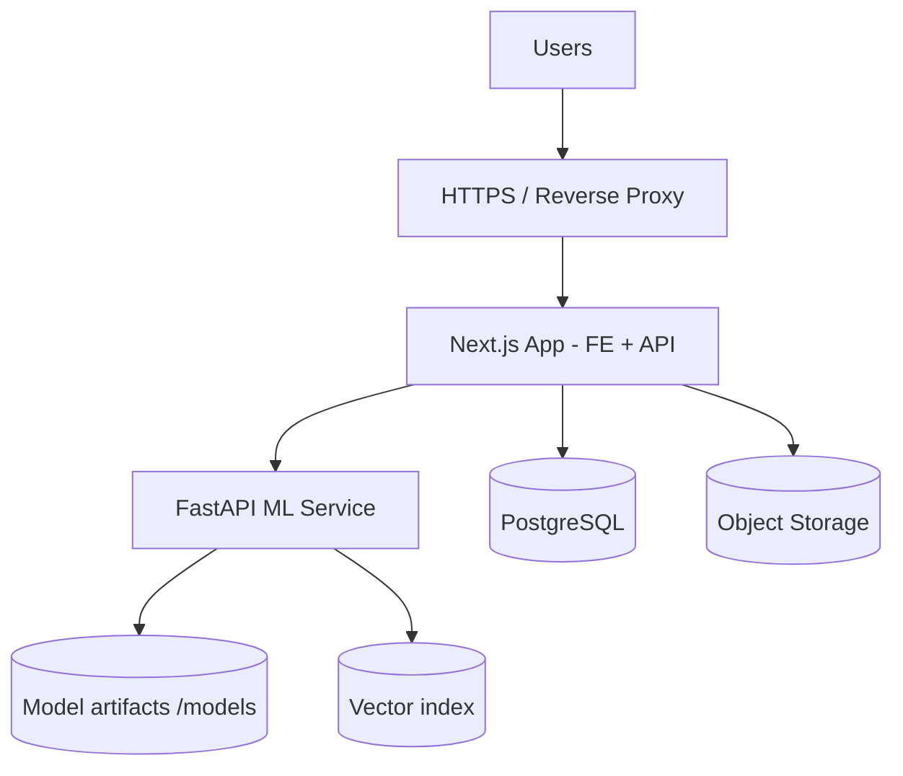
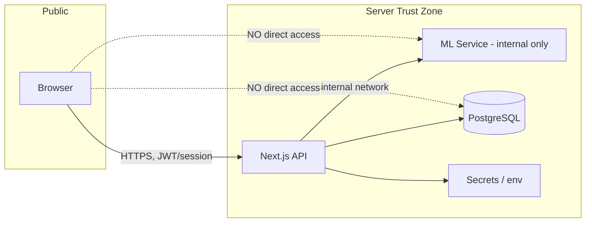

# 01 — Master System Architecture

**Project:** AI CivicEye — Intelligent Civic Complaint & Prioritization System
**Hackathon PS:** PS 5 — AI Innovation for Public Services & Citizen-Centric Governance
**Status of this document:** `[PROPOSED]` architecture. Only the base web scaffold is `[IMPLEMENTED]` (see §9).

> **Status legend (used across all docs):** `[PROPOSED]` · `[PLANNED]` · `[IMPLEMENTED]` · `[VERIFIED]` · `[REQUIRES VERIFICATION]`

---

## 1. System Overview

AI CivicEye is a multimodal AI **decision-support layer** for civic grievance redressal. Citizens submit civic problems using text, voice, image, and location. The system converts raw reports into **prioritized, routed, explainable civic incidents** for municipal authorities.

The system is intentionally split into three ownership domains that must **not** overlap:

| Domain | Responsibility (summary) | Primary tech |
| --- | --- | --- |
| **Frontend** | Citizen app + Authority dashboard (UI only) | Next.js (App Router) + React `[IMPLEMENTED scaffold]` |
| **Backend / API** | APIs, auth, persistence, orchestration, routing | Next.js Route Handlers + Drizzle ORM + PostgreSQL `[IMPLEMENTED scaffold]` |
| **ML service** | Vision, NLP, embeddings, severity, priority, explainability | Python + FastAPI microservice `[PROPOSED]` |

> **Stack note / reconciliation:** The repository already establishes **Next.js (App Router) + PostgreSQL via Drizzle ORM**. Therefore Next.js Route Handlers act as the backend/orchestration layer, and Python/FastAPI is scoped **only** to the ML inference microservice (models cannot run in the Node runtime). Earlier drafts proposed FastAPI as the whole backend — that is superseded by this reconciled design.

---

## 2. High-Level Pipeline (Citizen → Dashboard)

---

## 3. Component Architecture

---

## 4. Data Flow (Request Lifecycle)

---

## 5. Module Boundaries & Ownership

### 5.1 Frontend owns
- Citizen interface, complaint submission, image upload, voice input capture, location capture
- Complaint status/tracking views
- Authority dashboard, charts, maps
- **Does not**: run models, compute priority, or talk to the DB directly.

### 5.2 Backend / API owns
- REST APIs, authentication/authorization (RBAC)
- Complaint persistence & lifecycle
- Orchestration of ML calls (fusion of results)
- Department routing decision application
- Duplicate-detection **orchestration** (calls ML, persists clusters)
- Priority **orchestration** (calls ML/engine, persists result)
- Database interaction (Drizzle ORM) + audit trail
- **Does not**: contain model weights or training logic.

### 5.3 ML owns
- Image classification/detection, NLP classification, embeddings
- Duplicate similarity scoring, severity prediction, priority scoring
- Explainability generation
- **Does not**: own auth, persistence, or UI.

---

## 6. External Dependencies `[PROPOSED]`

| Dependency | Use | Status |
| --- | --- | --- |
| PostgreSQL | Primary datastore | `[IMPLEMENTED scaffold]` |
| Object/blob storage | Complaint media (images, audio) | `[PROPOSED]` |
| Speech-to-Text provider | Voice → text | `[PROPOSED]` |
| Vector index (e.g., pgvector / FAISS) | Embedding similarity | `[PROPOSED]` |
| Map tiles / geocoding provider | Hotspot map, reverse geocode | `[PROPOSED]` |

> All third-party providers must be accessed **server-side** via API routes reading `process.env` secrets. No secret is exposed to the browser.

---

## 7. Deployment Architecture `[PROPOSED]`

See `17_DEPLOYMENT.md` for details. Nothing here is deployed yet.

---

## 8. Security Boundary

- The ML service is **internal-only** and never exposed to the public internet.
- Only `NEXT_PUBLIC_*` env vars reach the browser; all keys/secrets stay server-side.
- Citizen PII is minimized and access-controlled (see `18_RISKS_AND_LIMITATIONS.md`).

---

## 9. Current Implementation Status

| Element | Status |
| --- | --- |
| Next.js App Router scaffold | `[IMPLEMENTED]` |
| PostgreSQL + Drizzle connection (`src/db`) | `[IMPLEMENTED]` |
| Health endpoint (`/api/health`) | `[IMPLEMENTED]` |
| All AI CivicEye features (complaints, ML, dashboard) | `[PROPOSED]` — not built in this task |

---

## 10. Consistency Anchors (single source of truth)

These canonical values are referenced by all other documents:

- **Complaint categories:** `POTHOLE_ROAD_DAMAGE`, `GARBAGE`, `DRAINAGE_WATERLOGGING`, `STREETLIGHT_FAILURE`, `FALLEN_TREE`, `WATER_LEAKAGE`, `OTHER`
- **CV MVP classes (subset, image-detectable):** `POTHOLE_ROAD_DAMAGE`, `GARBAGE`, `DRAINAGE_WATERLOGGING` (waterlogging), `FALLEN_TREE`
- **Severity levels:** `LOW`, `MEDIUM`, `HIGH`, `CRITICAL`
- **Priority:** numeric `score` 0–100 + `level` (`LOW`/`MEDIUM`/`HIGH`/`CRITICAL`)
- **Complaint lifecycle:** `SUBMITTED → ANALYZED → ROUTED → ACKNOWLEDGED → IN_PROGRESS → RESOLVED → CLOSED` (+ `REOPENED`, `REJECTED`, `DUPLICATE_MERGED`)
