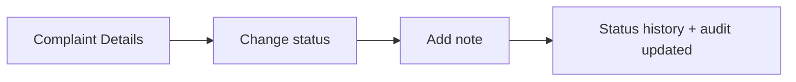

# 02 — Product Requirements Document (PRD)

**Project:** AI CivicEye
**Status:** `[PROPOSED]` product definition. No product features are implemented yet.

---

## 1. Problem Statement

Civic grievance systems today are largely **manual intake portals**. Complaints arrive as unstructured text or phone calls, are triaged by humans, and are prioritized inconsistently. Citizens cannot easily provide visual/voice evidence, duplicate reports of the same issue are logged separately, and authorities lack an objective, explainable way to decide **what to fix first**.

## 2. Background

Municipal bodies receive high volumes of civic complaints (roads, garbage, drainage, streetlights, trees, water). Existing tools focus on **registration**, not **understanding or prioritization**. AI CivicEye proposes an AI decision-support layer that classifies, de-duplicates, scores, and routes complaints while explaining every decision.

## 3. Target Users

- **Citizens** reporting civic issues.
- **Municipal authorities / operators** managing the incoming queue.
- **Department officers** who act on routed complaints.
- **System administrators** managing users, config, and integrations.

## 4. User Personas

| Persona | Goals | Pain points | Tech comfort |
| --- | --- | --- | --- |
| **Priya (Citizen)** | Report a pothole quickly with a photo; know it's being handled | Long forms, no feedback, unsure who to contact | Medium (smartphone) |
| **Rahul (Operator)** | See what matters most, avoid duplicate work | Flood of unstructured complaints, manual triage | Medium–High |
| **Meena (Dept. Officer)** | Get only relevant, actionable complaints for her department | Misrouted complaints, unclear urgency | Medium |
| **Arjun (Admin)** | Configure routing/weights, manage access, audit | No config control, no audit trail | High |

## 5. Current Problems (with existing systems)

1. Unstructured intake → manual classification.
2. No multimodal evidence (image/voice) handling.
3. Duplicate complaints inflate workload.
4. Prioritization is subjective and non-transparent.
5. Misrouting between departments.
6. Poor citizen feedback loop.

## 6. Proposed Solution

A multimodal AI system that ingests text/voice/image/location and produces a structured, prioritized, routed, and **explainable** civic incident, surfaced through a citizen app and an authority dashboard. See `01_MASTER_ARCHITECTURE.md`.

## 7. Goals

- G1: Accept multimodal complaints (text, voice, image, location).
- G2: Auto-classify complaints into canonical categories.
- G3: Estimate severity and an explainable priority score.
- G4: Detect duplicate/related complaints.
- G5: Route to the correct department.
- G6: Provide an authority dashboard (queue, clusters, map, analytics).
- G7: Maintain an audit trail for every AI-influenced decision.

## 8. Non-Goals

- Not a full ERP/work-order management replacement.
- Not an autonomous decision-maker (human stays in the loop).
- Not a payments/tax/utility-billing platform.
- Not guaranteeing legal SLA enforcement in MVP.

## 9. Functional Requirements

| ID | Requirement | Priority | Status |
| --- | --- | --- | --- |
| FR-1 | Citizen can submit a text complaint | Must | `[PROPOSED]` |
| FR-2 | Citizen can attach image evidence | Must | `[PROPOSED]` |
| FR-3 | Citizen can submit a voice complaint (STT) | Should | `[PROPOSED]` |
| FR-4 | Citizen can provide/capture location | Must | `[PROPOSED]` |
| FR-5 | System returns an AI analysis preview before submit | Should | `[PROPOSED]` |
| FR-6 | System classifies category + confidence | Must | `[PROPOSED]` |
| FR-7 | System estimates severity | Must | `[PROPOSED]` |
| FR-8 | System computes explainable priority | Must | `[PROPOSED]` |
| FR-9 | System detects duplicates/clusters | Should | `[PROPOSED]` |
| FR-10 | System routes to a department | Must | `[PROPOSED]` |
| FR-11 | Citizen can track complaint status | Must | `[PROPOSED]` |
| FR-12 | Authority can view a priority queue | Must | `[PROPOSED]` |
| FR-13 | Authority can view duplicate clusters | Should | `[PROPOSED]` |
| FR-14 | Authority can view map/hotspots | Should | `[PROPOSED]` |
| FR-15 | Authority can update complaint status | Must | `[PROPOSED]` |
| FR-16 | Audit log for status/AI decisions | Must | `[PROPOSED]` |

## 10. Non-Functional Requirements

| ID | Requirement | Target `[PROPOSED]` |
| --- | --- | --- |
| NFR-1 | Availability | Best-effort for hackathon demo |
| NFR-2 | Analysis latency | Interactive; graceful async fallback if slow |
| NFR-3 | Security | RBAC, server-side secrets, HTTPS |
| NFR-4 | Privacy | PII minimization, access control |
| NFR-5 | Explainability | Human-readable reasons for every AI decision |
| NFR-6 | Fail-safe | Degrade gracefully if ML service is down |
| NFR-7 | Auditability | All state changes logged |

> No latency/accuracy numbers are asserted; they will be measured after implementation.

## 11. User Journeys

### A. Citizen submits a text complaint

### B. Citizen submits an image complaint

### C. Citizen submits a voice complaint

### D. Authority reviews prioritized complaints

### E. Authority views a duplicate cluster

### F. Authority updates complaint status

## 12. MVP Scope

- Text + image intake, location.
- Category classification, severity, priority (configurable), department routing.
- Basic duplicate detection.
- Citizen tracking + authority priority queue + complaint details.
- Voice, advanced map hotspots, analytics = stretch goals.

## 13. Future Scope

- Multilingual (Hindi/Hinglish) at scale, SLA tracking, notifications, mobile app, offline reporting, deeper geospatial analytics, model retraining loop.

## 14. Success Metrics `[PLANNED]`

- % complaints auto-classified with confidence ≥ threshold.
- Duplicate-detection precision/recall (measured post-build).
- Operator time-to-triage reduction (qualitative in demo).
- Routing accuracy vs. ground truth (post-build).

> All metrics are to be **measured**, not asserted. Use `[Insert results after evaluation]` placeholders in reports.

## 15. Risks
See `18_RISKS_AND_LIMITATIONS.md`.

## 16. Assumptions
- Datasets are usable for training/prototyping (subject to verification).
- Authorities keep a human in the loop.
- Demo runs on a single-region deployment.

## 17. Constraints
- Hackathon timeline & student team size.
- Existing stack: Next.js + PostgreSQL/Drizzle (see `01_MASTER_ARCHITECTURE.md`).
- Synthetic BMC dataset limitations (see `06_DATA_AND_DATASET_SPEC.md`).
