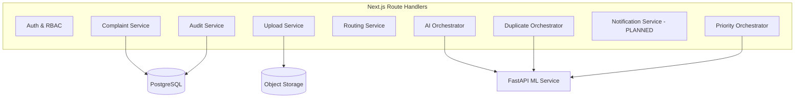
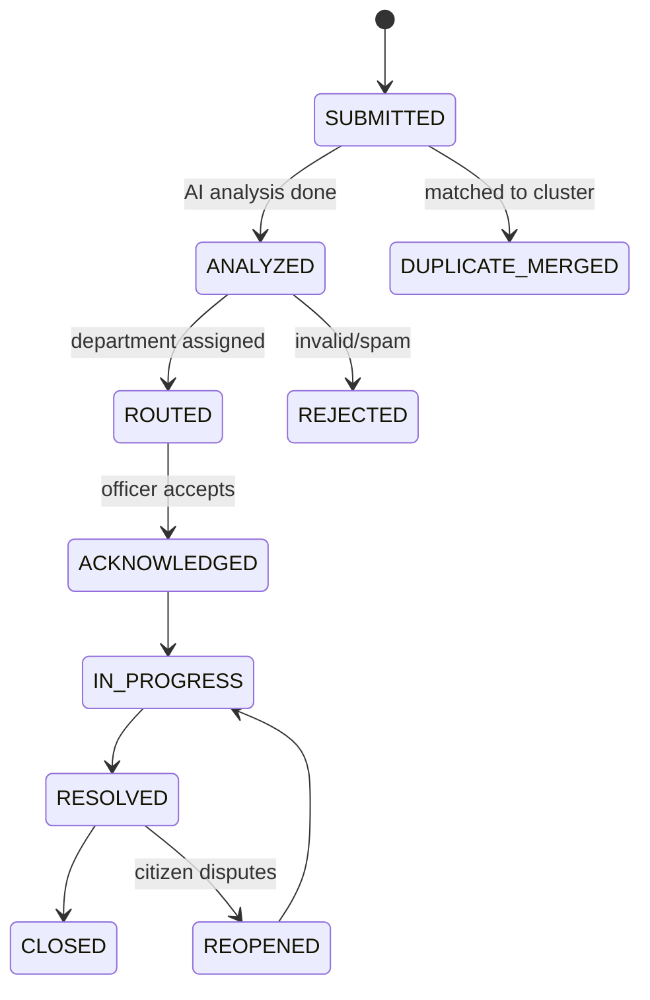
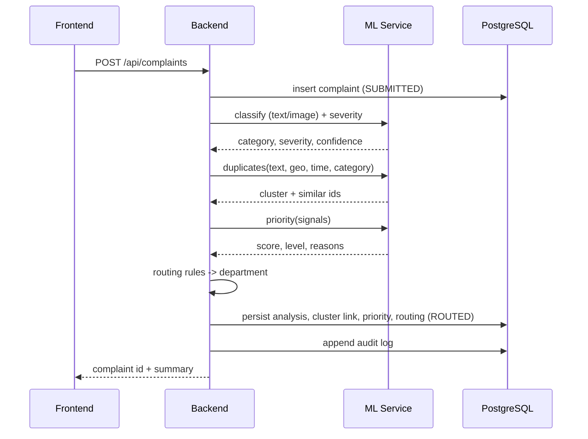

# 04 — Backend PRD

**Project:** AI CivicEye
**Status:** `[PROPOSED]`. Only the DB connection and `/api/health` exist today (`[IMPLEMENTED scaffold]`).

**Stack (reconciled with existing repo):** Next.js Route Handlers (App Router) + Drizzle ORM + PostgreSQL as the backend/orchestration layer. Python + FastAPI is a **separate internal ML microservice**. (Earlier drafts proposing FastAPI as the whole backend are superseded — see `01_MASTER_ARCHITECTURE.md`.)

---

## 1. Backend Responsibilities

- REST APIs (see `07_API_CONTRACT.md`)
- Authentication & authorization (RBAC)
- File upload handling (image/audio → object storage)
- Complaint persistence & lifecycle management
- Orchestration of ML inference (fusion of multimodal results)
- Department routing (apply routing rules/config)
- Duplicate-detection orchestration (call ML, persist clusters)
- Priority orchestration (call engine, persist assessment)
- Notifications `[PLANNED]`
- Database interaction via Drizzle
- Error handling, logging, audit trail

The backend does **not** hold model weights or training code (that is ML-owned).

---

## 2. Service Architecture (logical modules)



---

## 3. Complaint Lifecycle



---

## 4. Orchestration Sequence



---

## 5. Request / Response Models (representative) `[PROPOSED]`

**Create complaint (request)**
```json
{
  "text": "Large pothole near main road",
  "category_hint": "POTHOLE_ROAD_DAMAGE",
  "urgency": "HIGH",
  "location": { "lat": 19.07, "lng": 72.87, "address": "..." },
  "media": [{ "type": "IMAGE", "upload_id": "uuid" }]
}
```

**Create complaint (response)**
```json
{
  "id": "uuid",
  "status": "ROUTED",
  "category": "POTHOLE_ROAD_DAMAGE",
  "severity": "HIGH",
  "priority": { "score": 0, "level": "HIGH", "reasons": ["..."] },
  "department": "ROADS_MUNICIPAL_ENGINEERING",
  "duplicate": { "is_duplicate": false, "cluster_id": null }
}
```
Full contract: `07_API_CONTRACT.md`. All values illustrative.

---

## 6. Authentication & Authorization

- **AuthN:** session/JWT-based login `[PROPOSED]`. Citizens may submit with lightweight identity; authority users require accounts.
- **AuthZ (RBAC roles):** `CITIZEN`, `OPERATOR`, `DEPT_OFFICER`, `ADMIN`.

| Action | CITIZEN | OPERATOR | DEPT_OFFICER | ADMIN |
| --- | --- | --- | --- | --- |
| Create complaint | ✅ | ✅ | ✅ | ✅ |
| View own complaint | ✅ | ✅ | ✅ | ✅ |
| View all complaints | ❌ | ✅ | dept-scoped | ✅ |
| Update status | ❌ | ✅ | dept-scoped | ✅ |
| Manage clusters | ❌ | ✅ | ❌ | ✅ |
| Config weights/routing | ❌ | ❌ | ❌ | ✅ |

---

## 7. File Upload

- Client requests an upload slot; backend returns a signed/target path.
- Media stored in object storage; only metadata + keys in PostgreSQL (`ComplaintMedia`).
- Validate MIME type, size limits, and strip EXIF GPS if privacy mode enabled `[PLANNED]`.

---

## 8. Error Handling & Fail-Safe

- If ML service is unavailable: persist complaint as `SUBMITTED`, mark analysis `PENDING`, retry async, never lose the complaint.
- Standard error envelope:
```json
{ "error": { "code": "ML_UNAVAILABLE", "message": "Analysis deferred", "retryable": true } }
```
- Timeouts on ML calls; circuit-breaker pattern `[PLANNED]`.

---

## 9. Logging & Audit Trail

- **App logs:** structured request/error logs (no PII in logs where avoidable).
- **Audit log (`AuditLog` table):** who/what/when for status changes, routing overrides, cluster merges, config changes, and AI decisions applied.

---

## 10. Configuration

- Priority weights, severity thresholds, routing map, and duplicate thresholds are stored as **config** (DB or env), editable by `ADMIN`, versioned (`weights_version`).

---

## 11. Implementation Status

| Item | Status |
| --- | --- |
| DB connection (`src/db`) | `[IMPLEMENTED]` |
| `/api/health` | `[IMPLEMENTED]` |
| All complaint/ML/auth endpoints | `[PROPOSED]` |
