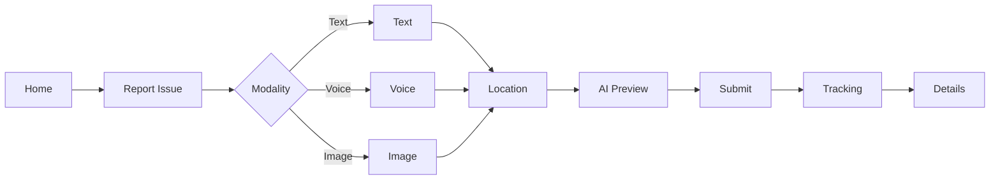
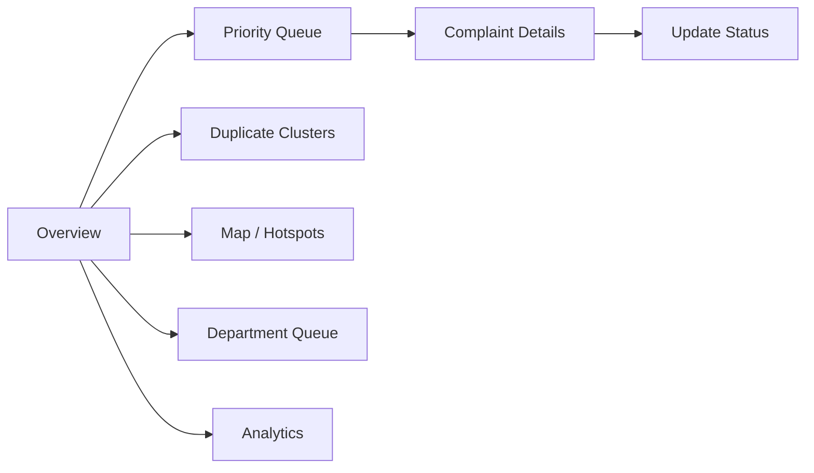

# 05 — Frontend PRD

**Project:** AI CivicEye
**Status:** `[PROPOSED]`. Only the base Next.js scaffold page exists (`[IMPLEMENTED scaffold]`).
**Stack:** Next.js (App Router) + React + Tailwind CSS (already wired via `src/app/globals.css`).

The frontend is **UI-only**: it calls backend APIs (`07_API_CONTRACT.md`) and never talks to the DB or ML service directly.

---

## 1. Two Interfaces

1. **Citizen Application** — report & track civic issues.
2. **Authority Dashboard** — triage, prioritize, route, resolve.

---

## 2. Citizen Application — Screens

For each screen: Purpose · Components · Data required · API required · User actions · Loading · Empty · Error.

### 2.1 Home
- **Purpose:** Entry point; start a report or track existing.
- **Components:** hero, "Report Issue" CTA, "Track complaint" input, recent activity.
- **Data:** none / user's recent complaints.
- **API:** `GET /api/complaints?mine=true` `[PROPOSED]`.
- **Actions:** navigate to Report / Track.
- **Loading:** skeleton cards. **Empty:** "No complaints yet." **Error:** retry banner.

### 2.2 Report Issue
- **Purpose:** Choose input modality (text/voice/image) + location.
- **Components:** modality tabs, location picker.
- **API:** none until submit/preview.

### 2.3 Text Complaint
- **Purpose:** Enter textual description.
- **Components:** textarea, optional category hint, urgency selector.
- **API:** `POST /api/complaints/analyze`.

### 2.4 Voice Complaint
- **Purpose:** Record voice → transcript.
- **Components:** recorder, transcript preview (editable).
- **API:** `POST /api/complaints/voice` → transcript → `analyze`. `[PROPOSED]`
- **Error:** mic permission denied, STT failure fallback to text.

### 2.5 Image Upload
- **Purpose:** Attach photo evidence.
- **Components:** file/camera input, preview, CV result preview.
- **API:** `POST /api/complaints/image` (upload) → `analyze`.
- **Error:** unsupported/blurry image → prompt to add text.

### 2.6 Location
- **Purpose:** Capture/confirm location.
- **Components:** map picker, GPS button, address field.
- **API:** reverse geocode `[PROPOSED]`.
- **Empty/Error:** manual address entry fallback.

### 2.7 AI Analysis Preview
- **Purpose:** Show predicted category/severity/priority + reasons **before** submit.
- **Components:** result card, confidence indicator, explanation list.
- **API:** response of `POST /api/complaints/analyze`.
- **Loading:** analyzing spinner. **Error:** "Analysis unavailable — you can still submit."

### 2.8 Submit Complaint
- **Purpose:** Persist the complaint.
- **API:** `POST /api/complaints`.
- **Actions:** confirm → receive complaint ID.

### 2.9 Complaint Tracking
- **Purpose:** List citizen's complaints with status.
- **API:** `GET /api/complaints?mine=true`.
- **Empty:** "No complaints yet."

### 2.10 Complaint Details
- **Purpose:** Full detail + status timeline + explanation.
- **API:** `GET /api/complaints/{id}`.

### Citizen user flow

---

## 3. Authority Dashboard — Screens

### 3.1 Overview
- **Purpose:** KPIs & trends snapshot.
- **Components:** KPI cards, charts (category/severity/status distribution).
- **API:** `GET /api/dashboard/overview`.
- **Empty:** "No data yet." **Note:** charts show real data only; no fabricated numbers.

### 3.2 Priority Queue
- **Purpose:** Complaints ordered by priority.
- **Components:** sortable/filterable table, priority badges.
- **API:** `GET /api/complaints/priority`.

### 3.3 Complaint Details
- **Purpose:** Full incident view with AI explanation + actions.
- **API:** `GET /api/complaints/{id}`, `PATCH /api/complaints/{id}/status`.

### 3.4 Duplicate Complaint Clusters
- **Purpose:** Review grouped/related complaints.
- **Components:** cluster list, member table, merge/split actions.
- **API:** `GET /api/complaints/duplicates`.

### 3.5 Map / Hotspot View
- **Purpose:** Geospatial distribution of complaints.
- **Components:** map, markers/heat layer, filters.
- **API:** `GET /api/complaints?bbox=...` `[PROPOSED]`.

### 3.6 Department Queue
- **Purpose:** Complaints routed to a specific department.
- **API:** `GET /api/complaints?department=...`.

### 3.7 Analytics
- **Purpose:** Trends over time (volume, resolution, cluster sizes).
- **API:** `GET /api/dashboard/overview` (extended) `[PROPOSED]`.
- **Note:** Only render charts from verified/real data.

### 3.8 Complaint Resolution
- **Purpose:** Update status, add notes, close.
- **API:** `PATCH /api/complaints/{id}/status`.

### Authority user flow

---

## 4. Cross-cutting UI States

Every data view must define: **loading** (skeletons/spinners), **empty** (clear guidance), **error** (retry + safe message). Never block the citizen from submitting if AI preview fails.

## 5. Implementation Status
All screens are `[PROPOSED]`. Only the starter landing page currently renders.
