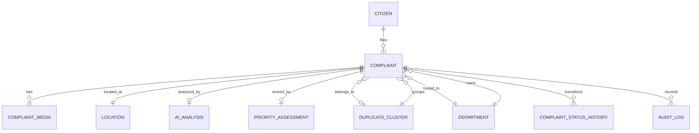

# 08 — Database Schema

**Project:** AI CivicEye
**Status:** `[PROPOSED]` schema. Not yet defined in `src/db/schema.ts` (currently empty scaffold). Target: PostgreSQL via Drizzle ORM.

Enumerations match `03_ML_PRD.md` §0 and `07_API_CONTRACT.md`.

---

## 1. ER Diagram

---

## 2. Enums `[PROPOSED]`

| Enum | Values |
| --- | --- |
| `category` | POTHOLE_ROAD_DAMAGE, GARBAGE, DRAINAGE_WATERLOGGING, STREETLIGHT_FAILURE, FALLEN_TREE, WATER_LEAKAGE, OTHER |
| `severity` | LOW, MEDIUM, HIGH, CRITICAL |
| `priority_level` | LOW, MEDIUM, HIGH, CRITICAL |
| `complaint_status` | SUBMITTED, ANALYZED, ROUTED, ACKNOWLEDGED, IN_PROGRESS, RESOLVED, CLOSED, REOPENED, REJECTED, DUPLICATE_MERGED |
| `media_type` | IMAGE, AUDIO |
| `user_role` | CITIZEN, OPERATOR, DEPT_OFFICER, ADMIN |
| `analysis_status` | PENDING, COMPLETED, FAILED |

---

## 3. Tables `[PROPOSED]`

### 3.1 `citizen`
| Column | Type | Notes |
| --- | --- | --- |
| id | uuid PK | |
| name | text | nullable (lightweight identity) |
| phone | text | nullable, unique-ish, PII |
| email | text | nullable, PII |
| role | user_role | default CITIZEN |
| created_at | timestamptz | default now |

### 3.2 `department`
| Column | Type | Notes |
| --- | --- | --- |
| id | uuid PK | |
| code | text UNIQUE | e.g., ROADS_MUNICIPAL_ENGINEERING |
| name | text | display name |
| default_categories | jsonb | categories it handles |

Seed departments (canonical): `ROADS_MUNICIPAL_ENGINEERING`, `SOLID_WASTE_MANAGEMENT`, `STORM_WATER_DRAINAGE`, `ELECTRICAL_STREET_LIGHTING`, `GARDENS_TREE_AUTHORITY`, `WATER_SUPPLY`, `GENERAL`.

### 3.3 `location`
| Column | Type | Notes |
| --- | --- | --- |
| id | uuid PK | |
| lat | double precision | |
| lng | double precision | |
| address | text | nullable |
| ward | text | nullable |
| geohash | text | index for proximity |

### 3.4 `complaint`
| Column | Type | Notes |
| --- | --- | --- |
| id | uuid PK | |
| citizen_id | uuid FK → citizen | |
| location_id | uuid FK → location | nullable |
| text | text | complaint description |
| category_hint | category | nullable (citizen-provided) |
| category | category | AI-assigned, nullable until analyzed |
| severity | severity | nullable until analyzed |
| urgency | severity | citizen-reported, nullable |
| status | complaint_status | default SUBMITTED |
| department_id | uuid FK → department | nullable until routed |
| cluster_id | uuid FK → duplicate_cluster | nullable |
| created_at | timestamptz | default now |
| updated_at | timestamptz | |

### 3.5 `complaint_media`
| Column | Type | Notes |
| --- | --- | --- |
| id | uuid PK | |
| complaint_id | uuid FK → complaint | |
| type | media_type | |
| storage_key | text | object-storage key |
| mime | text | |
| created_at | timestamptz | |

### 3.6 `ai_analysis`
| Column | Type | Notes |
| --- | --- | --- |
| id | uuid PK | |
| complaint_id | uuid FK → complaint (unique) | 1:1 |
| status | analysis_status | default PENDING |
| category | category | nullable |
| category_confidence | real | 0–1 |
| severity | severity | nullable |
| severity_confidence | real | 0–1 |
| cv_result | jsonb | raw CV output |
| nlp_result | jsonb | raw NLP output |
| explanation | jsonb | list of reasons |
| model_versions | jsonb | model/weights versions |
| created_at | timestamptz | |

### 3.7 `priority_assessment`
| Column | Type | Notes |
| --- | --- | --- |
| id | uuid PK | |
| complaint_id | uuid FK → complaint (unique) | 1:1 |
| score | integer | 0–100 |
| level | priority_level | |
| signals | jsonb | per-signal contributions |
| reasons | jsonb | human-readable reasons |
| weights_version | text | config version |
| created_at | timestamptz | |

### 3.8 `duplicate_cluster`
| Column | Type | Notes |
| --- | --- | --- |
| id | uuid PK | |
| category | category | dominant category |
| representative_complaint_id | uuid | nullable |
| centroid | jsonb | optional centroid/geo |
| size | integer | cached member count |
| created_at | timestamptz | |

### 3.9 `complaint_status_history`
| Column | Type | Notes |
| --- | --- | --- |
| id | uuid PK | |
| complaint_id | uuid FK → complaint | |
| from_status | complaint_status | nullable |
| to_status | complaint_status | |
| note | text | nullable |
| changed_by | uuid FK → citizen | actor |
| created_at | timestamptz | |

### 3.10 `audit_log`
| Column | Type | Notes |
| --- | --- | --- |
| id | uuid PK | |
| entity_type | text | e.g., complaint, cluster, config |
| entity_id | uuid | |
| action | text | e.g., STATUS_CHANGE, ROUTE, MERGE |
| actor_id | uuid | nullable (system) |
| payload | jsonb | before/after |
| created_at | timestamptz | |

---

## 4. Relationships (summary)
- `citizen 1—* complaint`
- `complaint 1—1 location` (nullable), `1—* complaint_media`
- `complaint 1—1 ai_analysis`, `1—1 priority_assessment`
- `complaint *—1 department`, `complaint *—0..1 duplicate_cluster`
- `complaint 1—* complaint_status_history`
- `* —* audit_log` (polymorphic via entity_type/entity_id)

## 5. Indexes & Constraints `[PROPOSED]`
- `complaint(status)`, `complaint(category)`, `complaint(department_id)`, `complaint(cluster_id)`, `complaint(created_at)`.
- `location(geohash)` for proximity queries; consider **pgvector** for embeddings and **PostGIS** for geo `[REQUIRES VERIFICATION]` (availability in sandbox).
- Unique: `ai_analysis(complaint_id)`, `priority_assessment(complaint_id)`, `department(code)`.
- FK constraints with sensible `ON DELETE` (e.g., media cascade, cluster set null).

## 6. Notes
- Embeddings for duplicate detection may live in a **vector column** (pgvector) or an external index (FAISS). Storage choice `[PROPOSED]` — see `12_DUPLICATE_DETECTION.md`.
- Schema to be created in `src/db/schema.ts` and applied with `npx drizzle-kit push` **in a later implementation task** (not this one).
