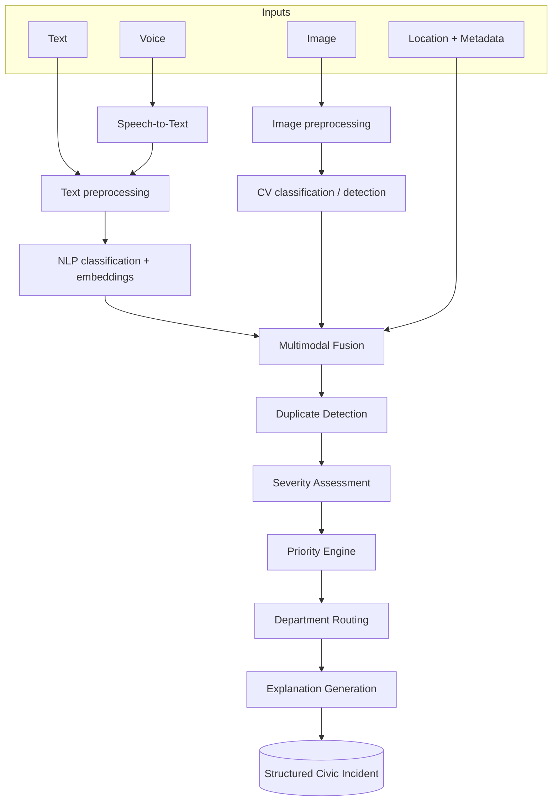
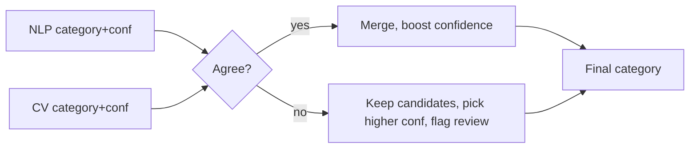

# 09 — AI Pipeline (Multimodal)

**Project:** AI CivicEye
**Status:** `[PROPOSED]`. Describes the end-to-end multimodal flow orchestrated by the backend across the ML service.

---

## 1. Full Pipeline

---

## 2. Stage-by-Stage

### 2.1 Text stream
- **Preprocessing:** normalize, language detect (en/hi/hinglish), clean, tokenize.
- **NLP:** category classification (`ML-01`) + sentence embeddings for similarity. See `11_NLP_MODULE.md`.

### 2.2 Image stream
- **Preprocessing:** resize, EXIF-orient, normalize.
- **CV:** classify/detect civic issue (`ML-02`), produce category + confidence (+ boxes). See `10_CV_MODULE.md`.

### 2.3 Voice stream
- **Speech-to-Text:** audio → transcript (`process.env` provider key, server-side).
- Transcript then flows into the **text stream** (NLP).

### 2.4 Multimodal fusion
Combines NLP + CV + metadata into a single category decision:
- If only one modality present → use it.
- If both present and **agree** → keep category, increase confidence.
- If they **disagree** → keep both as candidates; choose higher-confidence, flag `needs_review`.
- Location/metadata may adjust context (e.g., near main road → road-damage plausibility).

### 2.5 Duplicate detection
Using fused category + text embedding + geo + time → find cluster / nearest neighbors (`ML-03`, `12_DUPLICATE_DETECTION.md`).

### 2.6 Severity assessment
Category + text + urgency + cluster size + context → severity level (`ML-04`).

### 2.7 Priority engine
Severity + cluster size + urgency + location impact + persistence + confidence → score/level/reasons (`ML-05`, `13_PRIORITY_ENGINE.md`).

### 2.8 Department routing
Category → department via configurable routing map (backend-owned). Overrides logged to audit.

### 2.9 Explanation generation
Aggregate per-stage reasons into a human-readable explanation (`ML-06`).

---

## 3. Fail-safe behavior
- Any stage may degrade: if CV fails, use text-only; if ML service down, persist complaint and defer analysis (`analysis_status=PENDING`).
- The citizen is never blocked from submitting due to AI failure.

## 4. Output contract
The pipeline result maps directly to `ai_analysis` + `priority_assessment` + `complaint.department_id` + `cluster_id` (see `08_DATABASE_SCHEMA.md`) and to the `POST /api/complaints` response (`07_API_CONTRACT.md`).

> All confidence/score examples elsewhere are **illustrative**, not real model outputs.
