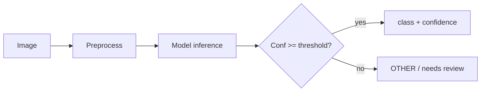

# 10 — Computer Vision Module

**Project:** AI CivicEye
**Status:** `[PROPOSED]`. No CV model is trained/evaluated. **No metrics are claimed.**

---

## 1. Problem Definition
Given a citizen-submitted image, predict the civic issue class (and, where applicable, localize/segment the defect) to assist classification and severity.

## 2. Supported Classes (MVP candidate)
`POTHOLE_ROAD_DAMAGE`, `GARBAGE`, `DRAINAGE_WATERLOGGING` (waterlogging), `FALLEN_TREE`.

> Verified image datasets currently cover **road damage** only (see `06_DATA_AND_DATASET_SPEC.md`). Other classes are `[REQUIRES VERIFICATION]` pending suitable data. MVP may ship **road-damage detection first**.

## 3. Dataset Strategy
- **Zenodo 7681359** `[VERIFIED]`: healthy vs damaged road images → binary road-damage classification baseline.
- **Zenodo 17952339** `[VERIFIED]`: 400 pixel-annotated crack images (RDD2022-derived, 80/15/5 split) → segmentation option.
- Additional data for garbage/waterlogging/fallen-tree → `[REQUIRES VERIFICATION]`.

## 4. Dataset Preparation
- Verify licenses before use.
- Convert to a consistent format; build a manifest (path, label/mask, split).
- Normalize resolution; handle panorama vs standard images separately (7681359 has both).

## 5. Train / Validation / Test Split
- Use dataset-provided split when available (17952339: 320/60/20).
- Else stratified split with fixed seed; prevent near-duplicate leakage across splits.

## 6. Augmentation (train only)
Horizontal flip, small rotation, brightness/contrast jitter, random crop/scale, mild blur/noise (to simulate real phone photos), optional weather/shadow simulation.

## 7. Candidate Models (not yet selected)
| Model | Task | Pros | Cons |
| --- | --- | --- | --- |
| MobileNet | classification | fast, small | lower ceiling |
| EfficientNet | classification | accuracy/size balance | training cost |
| ResNet | classification | strong baseline | larger |
| YOLO (v8/11) | detection | multi-defect localization | heavier, needs boxes |
| UNet / DeepLab | segmentation | pixel masks (17952339) | needs mask labels |

## 8. Training
Transfer learning from ImageNet-pretrained backbone; class-balanced sampling; early stopping on validation metric; log runs (config, seed, versions).

## 9. Evaluation Metrics (to be measured)
- **Classification:** accuracy, precision, recall, F1, confusion matrix.
- **Detection/Segmentation:** mAP, IoU, precision, recall.

> Do **not** invent achieved values. Reports must use `[Insert model evaluation results after training]`. Any example confusion matrix must be labeled **"Illustrative — not actual model results."**

## 10. Inference
Single image → class + confidence (+ boxes/mask). Return raw output to backend as `ai_analysis.cv_result` (jsonb).

## 11. Confidence Threshold
Below a configurable threshold → treat as `OTHER` / "needs human review" and prompt the citizen to add text.

## 12. Unsupported / Low-Quality Image Handling
- Non-civic, off-topic, or unrecognizable → low-confidence `OTHER`.
- Blurry/too-dark → quality warning, ask for retake or text.
- Never hard-fail the submission.

## 13. Model Storage
Export trained weights to `models/cv/` with a version tag; ML service loads them at startup. Never commit large weights to git (see `.gitignore`).

## 14. API Integration
Called via internal `POST /ml/classify/image`; surfaced to citizens through backend `POST /api/complaints/image` (`07_API_CONTRACT.md`). CV result participates in fusion (`09_AI_PIPELINE.md`).

## 15. Pipeline Diagram

