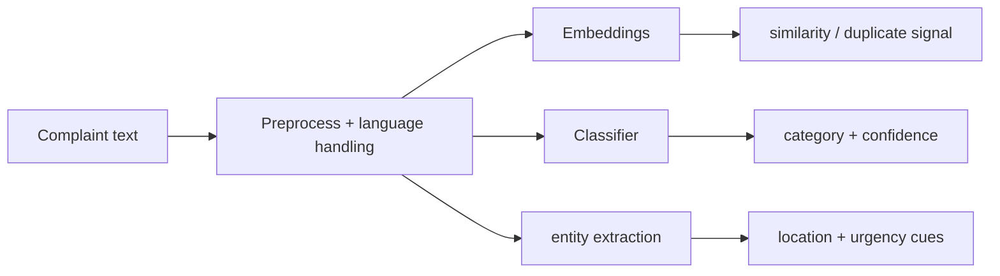

# 11 — NLP Module

**Project:** AI CivicEye
**Status:** `[PROPOSED]`. No NLP model trained/evaluated. **No metrics are claimed.**

---

## 1. Responsibilities
- Complaint text preprocessing
- Category classification (`ML-01`)
- Sentence embeddings (for duplicate detection & similarity)
- Entity extraction (location cues, landmarks, keywords)
- Support department routing signals

## 2. Language Considerations
Civic complaints in the target region are commonly **English, Hindi, and Hinglish** (code-mixed).
- **Baseline:** English-focused pipeline + transliteration/normalization for Hinglish.
- **Better:** multilingual sentence embeddings / multilingual transformer.
- Language handling is `[REQUIRES VERIFICATION]` against the actual dataset language distribution.

## 3. Preprocessing
Lowercasing (where appropriate), Unicode normalization, punctuation/emoji handling, stopword handling (language-aware), optional transliteration (Hinglish → normalized), PII redaction where present.

## 4. Text Classification
| Stage | Approach | Label |
| --- | --- | --- |
| Baseline | TF-IDF + Logistic Regression / Linear SVM | `[PROPOSED]` |
| Improved | Sentence embeddings + lightweight classifier | `[PROPOSED]` |
| Final | Fine-tuned transformer (mono/multilingual) | `[PROPOSED]` |

**Baseline vs final are clearly distinct**: start with TF-IDF for a fast, explainable baseline; upgrade only if data volume/quality supports it.

**Output:** `{ category, confidence, candidates[] }` → canonical categories (`03_ML_PRD.md` §0).

## 5. Embeddings
- Produce a fixed-length vector per complaint for semantic similarity.
- Store for reuse (vector column / index) — see `12_DUPLICATE_DETECTION.md`.
- Candidate: sentence-transformer style embeddings (model choice `[REQUIRES VERIFICATION]`).

## 6. Semantic Similarity
Cosine similarity between complaint embeddings; used by duplicate detection and "similar complaints" features.

## 7. Entity Extraction
Extract landmarks, road names, ward/area cues, and urgency keywords (e.g., "accident", "injury", "overflow") to feed severity/priority signals. Approach: rule/gazetteer baseline → NER model `[PLANNED]`.

## 8. Department Routing Signal
Category → department mapping is backend-owned config; NLP contributes the category and extracted cues. NLP does **not** make the final routing decision.

## 9. Evaluation Metrics (to be measured)
Accuracy, precision, recall, F1 (per class + macro), confusion matrix. Use `[Insert results after evaluation]`. Never fabricate.

## 10. Pipeline Diagram

