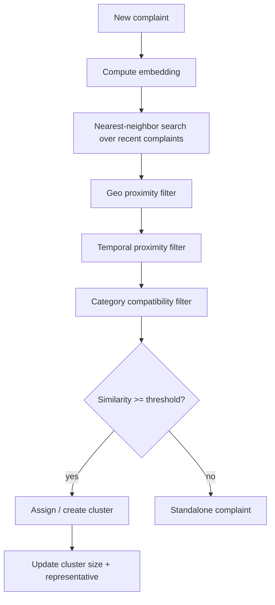

# 12 — Duplicate / Similar Complaint Detection

**Project:** AI CivicEye
**Status:** `[PROPOSED]`. No implementation/metrics.

---

## 1. The Problem
Multiple citizens report the **same underlying civic issue** with different wording. Logging them separately inflates workload and distorts priority.

**Example**
- Complaint A: *"Pothole near XYZ road."*
- Complaint B: *"Large road hole near XYZ."*

These share **meaning** but few exact words. Exact/keyword matching fails on paraphrases, typos, and code-mixed (Hinglish) text. **Semantic similarity** (via embeddings) captures that A and B are potentially the same issue.

## 2. Signals Used
| Signal | Source | Role |
| --- | --- | --- |
| Text embedding similarity | NLP embeddings + cosine | primary semantic match |
| Geographic proximity | location lat/lng / geohash | same place? |
| Temporal proximity | created_at | same time window? |
| Category compatibility | AI category | same issue type? |

A pair is a candidate duplicate only if it passes **all** enabled gates (semantic + geo + time + category), each with configurable thresholds.

## 3. Architecture



## 4. Method
1. Embed complaint text (`11_NLP_MODULE.md`).
2. Retrieve candidate neighbors (pgvector / FAISS) within a recent time window & geo radius.
3. Apply geo + temporal + category gates.
4. Compute combined similarity; if ≥ threshold, attach to existing cluster (or create one).
5. Maintain `duplicate_cluster` (size, representative, category).

## 5. Thresholding
- Cosine similarity threshold, geo radius (e.g., meters), and time window are **configurable** and must be **tuned experimentally**. Defaults are placeholders, **not validated**.

## 6. Clustering
- Incremental nearest-neighbor assignment for online use.
- Optional periodic batch re-clustering (e.g., connected components / DBSCAN over similarity graph) `[PLANNED]`.

## 7. False-Positive Handling
- Never auto-delete complaints; clustering is **advisory**.
- Authorities can confirm/merge or split clusters (UI in `05_FRONTEND_PRD.md` §3.4); actions are audit-logged.
- Conservative thresholds to prefer precision; borderline pairs flagged for human review.

## 8. Output
```json
{ "is_duplicate": true, "cluster_id": "uuid", "similar_complaint_ids": ["..."], "similarity_scores": [0.0], "match_reasons": ["semantic", "geo<50m", "same_category", "within_7d"] }
```

## 9. Evaluation (to be measured)
Precision, recall, F1 of duplicate pairs against a hand-labeled gold set; cluster purity. Use `[Insert results after evaluation]`. No fabricated numbers.
