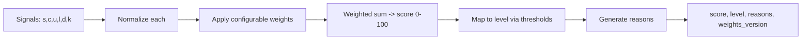

# 13 — Priority Engine

**Project:** AI CivicEye
**Status:** `[PROPOSED]`. Configurable, explainable scoring framework. **Weights are NOT scientifically validated** — they are placeholders to be tuned/evaluated.

---

## 1. Goal
Convert an analyzed complaint into a transparent **priority score (0–100)** and **level** (`LOW`/`MEDIUM`/`HIGH`/`CRITICAL`) with human-readable reasons.

## 2. Inputs / Signals
| Signal | Symbol | Description | Normalization |
| --- | --- | --- | --- |
| Severity | `s` | LOW..CRITICAL → 0..1 | ordinal map |
| Cluster size / affected citizens | `c` | # related complaints | log-scaled, capped |
| Urgency (citizen-reported) | `u` | LOW..CRITICAL → 0..1 | ordinal map |
| Location impact | `l` | near school/hospital/main road | rule → 0..1 |
| Persistence / duration | `d` | days since first report | scaled, capped |
| Confidence adjustment | `k` | model confidence | 0..1 |

## 3. Scoring Framework
```
priority_score = 100 * ( w_s*s + w_c*c + w_u*u + w_l*l + w_d*d + w_k*k )
```
With default (illustrative, **not validated**) weights summing to 1:

| Weight | Default |
| --- | --- |
| w_s | 0.35 |
| w_c | 0.20 |
| w_u | 0.15 |
| w_l | 0.15 |
| w_d | 0.10 |
| w_k | 0.05 |

**Level thresholds (placeholders):** `≥75 → CRITICAL`, `≥50 → HIGH`, `≥25 → MEDIUM`, else `LOW`.

## 4. Architecture


## 5. Configurability
- Weights, normalization caps, and thresholds stored as versioned config (`weights_version`), editable by `ADMIN` (`04_BACKEND_PRD.md` §10).
- Changing config never rewrites history; new assessments use the new version; audit-logged.

## 6. Explainability Output
```json
{
  "score": 0,
  "level": "HIGH",
  "signals": { "s": 0.0, "c": 0.0, "u": 0.0, "l": 0.0, "d": 0.0, "k": 0.0 },
  "reasons": ["severity=HIGH", "cluster_size=17 (illustrative)", "persisted 10 days (illustrative)"],
  "weights_version": "v0"
}
```

## 7. Validation Plan `[PLANNED]`
- Compare engine ranking vs. human triage on a labeled sample.
- Sensitivity analysis on weights.
- Iterate thresholds; document chosen values and rationale.

> Until validated, all weights/thresholds are explicitly **provisional**. Example numbers are **illustrative**, not real outputs.
