# 14 — Project Report

**Project:** AI CivicEye — Intelligent Civic Complaint & Prioritization System
**Hackathon PS:** PS 5 — AI Innovation for Public Services & Citizen-Centric Governance
**Status:** `[PROPOSED]` design report. Only the base Next.js + PostgreSQL scaffold is `[IMPLEMENTED]`. **No results, metrics, or screenshots are fabricated.**

> Written to be understandable by a teammate who has **not** worked on the project. Diagrams are used to explain, not decorate.

---

## 1. Executive Summary
AI CivicEye is a multimodal AI decision-support layer for civic grievance redressal. Citizens report issues via text, voice, image, and location; the system classifies, de-duplicates, scores priority, routes to the right department, and **explains** each decision — surfaced through a citizen app and an authority dashboard.

## 2. Problem
Civic complaint systems are mostly manual intake portals. They don't understand multimodal evidence, don't detect duplicates, and prioritize inconsistently. Authorities lack an objective, explainable way to decide what to fix first. (See `02_PRD.md`.)

## 3. Why Existing Systems Are Insufficient

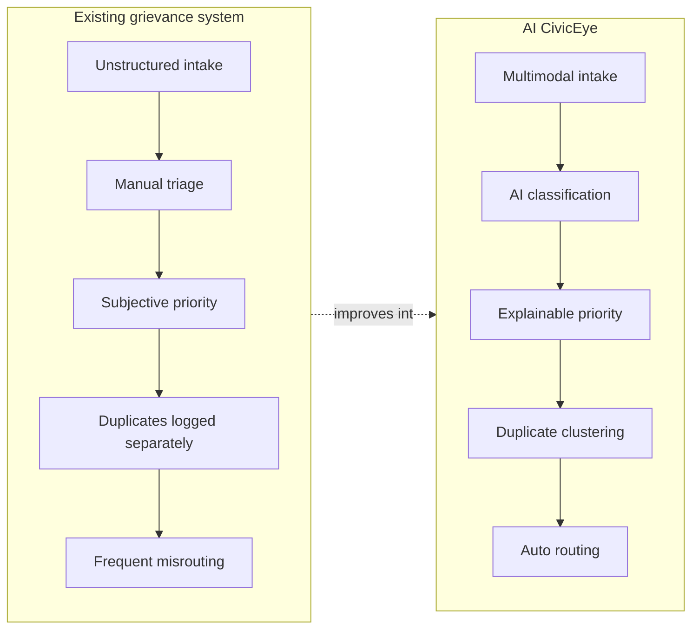

## 4. AI CivicEye (Solution)
A three-domain system — Frontend (UI), Backend/API (orchestration + persistence), ML service (models) — that turns raw reports into structured, prioritized, routed, explainable incidents. (See `01_MASTER_ARCHITECTURE.md`.)

## 5. Innovation
Not just a registration portal: it **combines** CV + NLP + voice + duplicate detection + severity + explainable priority + routing + geospatial analytics into one decision-support layer.

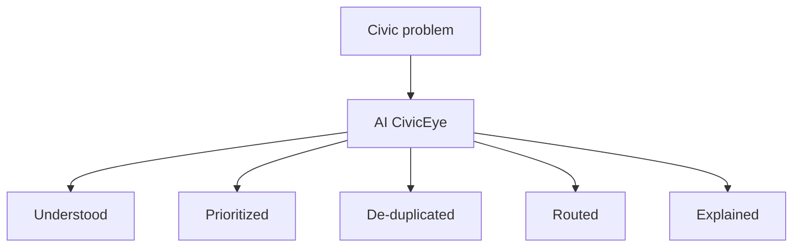

## 6. Target Users
Citizen · Operator · Department officer · Administrator. (Personas in `02_PRD.md`.)

## 7. End-to-End Workflow (Citizen)
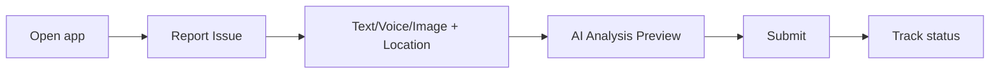

## 8. System Architecture
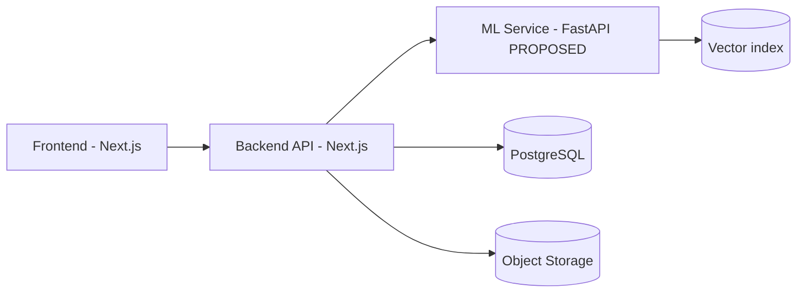
(Full version + ownership in `01_MASTER_ARCHITECTURE.md`.)

## 9. Data Architecture
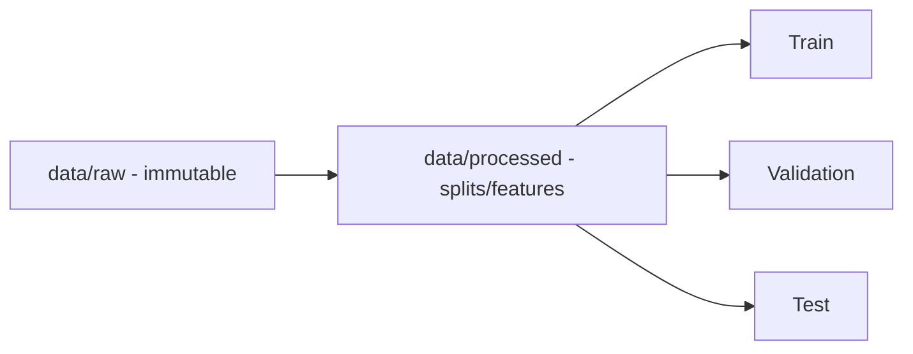
Datasets: synthetic BMC complaint dataset (text) + verified Zenodo road-image datasets (vision). (See `06_DATA_AND_DATASET_SPEC.md`.)

## 10. ML Architecture
Modules ML-01..ML-06: classification, CV, duplicate detection, severity, priority, explainability. (See `03_ML_PRD.md`.)

## 11. Computer Vision
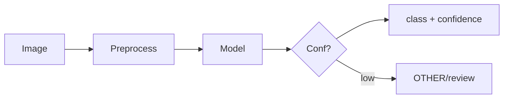
MVP class focus: road damage (verified data). (See `10_CV_MODULE.md`.)

## 12. NLP
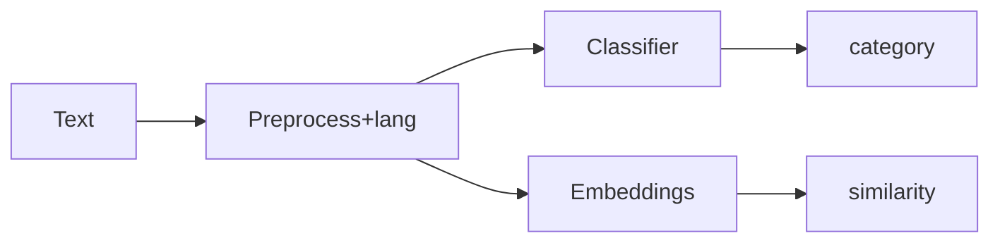
(See `11_NLP_MODULE.md`.)

## 13. Duplicate Detection
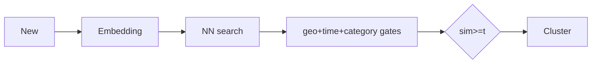
(See `12_DUPLICATE_DETECTION.md`.)

## 14. Priority Engine

Configurable, explainable; weights **not yet validated**. (See `13_PRIORITY_ENGINE.md`.)

## 15. Backend
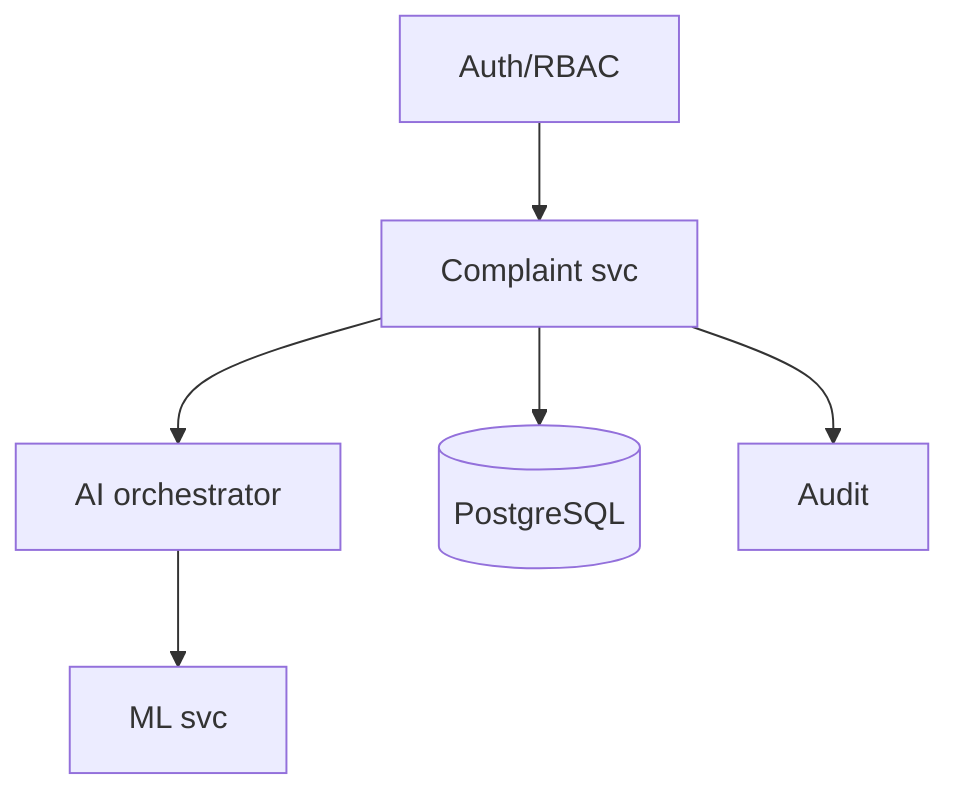
(See `04_BACKEND_PRD.md`.)

## 16. Frontend
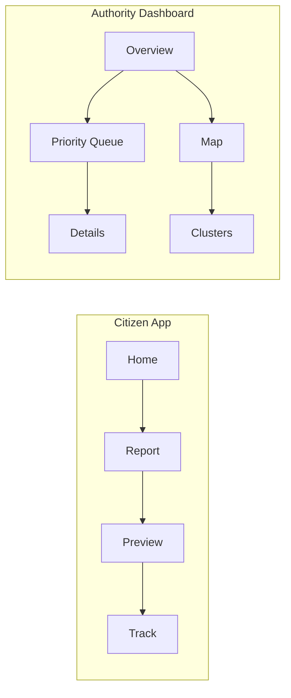
(See `05_FRONTEND_PRD.md`.)

## 17. Database
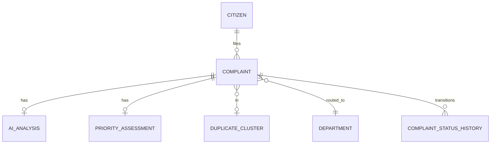
(Full ERD in `08_DATABASE_SCHEMA.md`.)

## 18. APIs
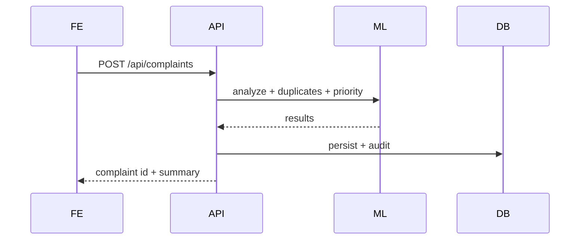
(Full contract in `07_API_CONTRACT.md`.)

## 19. Security
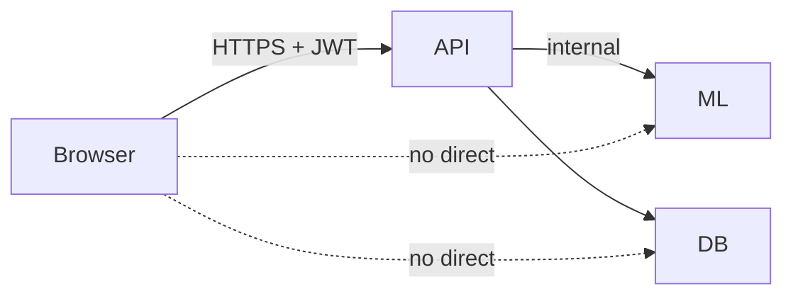
RBAC roles, server-side secrets, internal-only ML. (See `01` §8, `04` §6.)

## 20. Testing
Unit, API, ML, CV, NLP, integration, frontend, security, edge cases; system must **fail safely**. (See `16_TESTING_AND_VALIDATION.md`.)

## 21. Dataset Limitations
BMC dataset is **synthetic**; verified image datasets cover road damage only; other CV classes need data. (See `06` and `18`.)

## 22. Expected Impact `[PLANNED]`
Faster, more consistent, explainable triage; fewer duplicate work orders; better routing. Impact to be **measured**, not asserted.

## 23. Scalability
Stateless API scaling; ML service scaled independently; vector index for similarity; object storage for media; DB indexes for queries.

## 24. Future Scope
Multilingual at scale, SLA tracking, notifications, mobile app, offline reporting, retraining loop, richer geospatial analytics.

## 25. Risks
Synthetic-data mismatch, false duplicates, wrong severity, language variation, location inaccuracy, model bias, privacy. (See `18_RISKS_AND_LIMITATIONS.md`.)

## 26. Conclusion
AI CivicEye proposes a realistic, student-implementable, explainable AI layer for civic grievance redressal. This report is a **design specification**; implementation and evaluation follow in later steps.

---

## Appendix A — Complaint Lifecycle
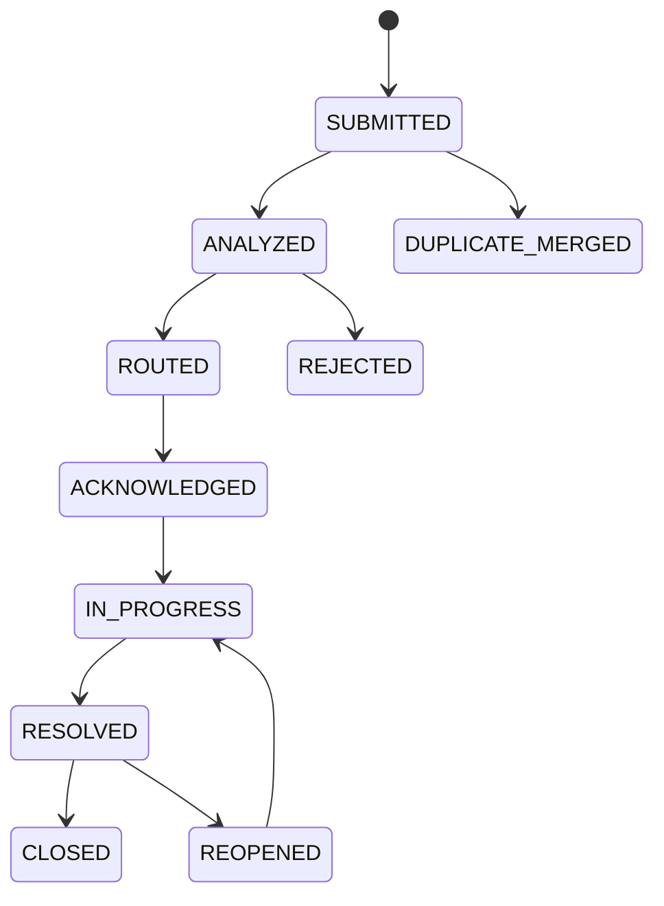

## Appendix B — Deployment Architecture
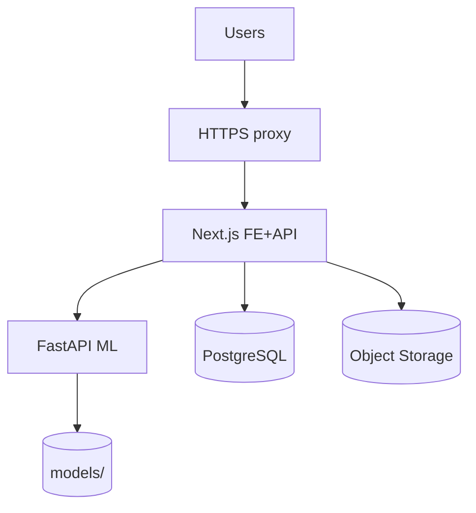

## Appendix C — Authority Dashboard Conceptual Layout
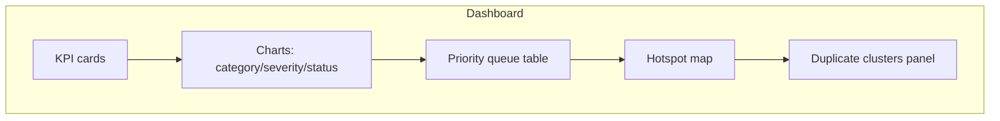

## Appendix D — Recommended Charts (real data only)
Category distribution · severity distribution · department distribution · volume over time · resolution status · duplicate cluster sizes · geographic hotspots · confusion matrix · precision/recall/F1 · priority distribution.

> **Do not fabricate performance graphs.** Where results are unavailable, write `[Insert model evaluation results after training]`. Any illustrative chart must be labeled **"Illustrative — not actual model results."**
