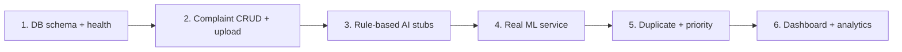

# 15 — Team Implementation Guide

**Project:** AI CivicEye
**Status:** `[PLANNED]` guide for building the system after this documentation step.

---

## 1. Workstreams (flexible for team size)

### Member A — ML / CV
- Acquire & verify datasets (`06_DATA_AND_DATASET_SPEC.md`).
- Preprocessing + augmentation pipeline.
- Train CV model (road damage first), evaluate, export to `models/cv/`.
- Deliver `POST /ml/classify/image`.

### Member B — NLP / AI
- Text preprocessing + language handling.
- Category classifier (TF-IDF baseline → embeddings/transformer).
- Embeddings + duplicate detection.
- Severity logic + priority engine (configurable weights).
- Deliver `POST /ml/classify/text`, `/ml/duplicates`, `/ml/severity`, `/ml/priority`.

### Member C — Backend
- Drizzle schema (`08_DATABASE_SCHEMA.md`) + `drizzle-kit push`.
- Auth/RBAC, complaint CRUD, upload, orchestration, routing, audit.
- Implement API contract (`07_API_CONTRACT.md`).

### Member D — Frontend
- Citizen app + authority dashboard (`05_FRONTEND_PRD.md`).
- Maps, charts (real data only), loading/empty/error states.

> Small team (2–3): merge A+B (AI) and C+D (app). Solo: build backend + rule-based AI baseline first, then upgrade.

## 2. Dependencies
- Node/Next.js + PostgreSQL (already in repo).
- Python + FastAPI + ML libs for the ML service (`ml/`), separate virtualenv.
- Object storage + STT + geocoding providers via `process.env` secrets.

## 3. Integration Order

Build against **contracts first** (mock ML), then swap in real models.

## 4. Shared Contracts (source of truth)
- Enums: `03_ML_PRD.md` §0. API: `07_API_CONTRACT.md`. DB: `08_DATABASE_SCHEMA.md`.
- Any contract change must update these docs first, then code.

## 5. Git Branching (recommended)
- `main` (protected) ← PRs only.
- `feat/<area>-<short>` per task (e.g., `feat/backend-complaints`).
- Small PRs, reviewed by one other member.
- (Repo is **not yet a git repo** — run `git init` before starting implementation.)

## 6. Definition of Done (per task)
- Meets contract; typechecks (`tsc --noEmit`); builds (`npm run build`).
- Handles loading/empty/error (frontend) or fail-safe (backend/ML).
- Basic tests added; no fabricated data/metrics; docs updated.

## 7. Integration Checkpoints
- **CP1:** DB + health + complaint create/list.
- **CP2:** AI preview via mock ML.
- **CP3:** Real CV + NLP wired.
- **CP4:** Duplicate + priority end-to-end.
- **CP5:** Dashboard with real aggregates.
- **CP6:** Demo-ready + validation passing.
